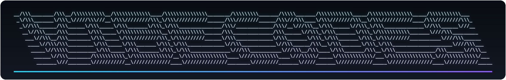

  

<i>Organisation that holds all useful things m5rcel has vibecoded.</i>

## What's a "vibecode"?

Everything in here started as a detailed, production-grade prompt rather than a blank file — the build comes from steering an AI through the implementation instead of typing every line by hand. "Vibecoded" describes the process, not the standards: no placeholders, no half-finished demos, no stubbed-out functions waiting for "TODO: implement later." If it's pushed here, it runs.

## Browse

Maintained by <a href="https://github.com/m4rcel-lol">m5rcel</a>.

